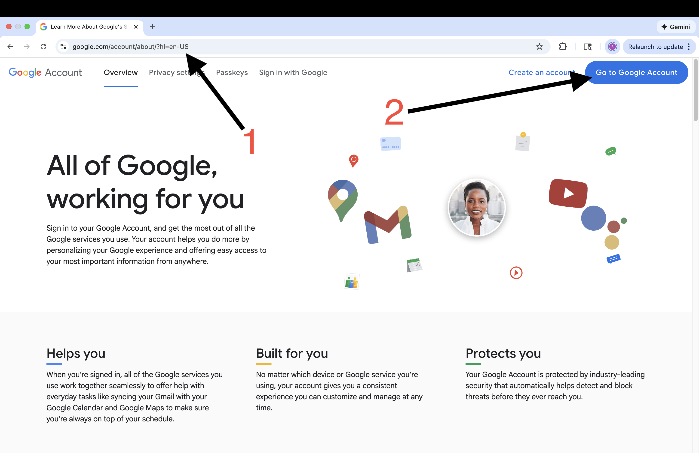
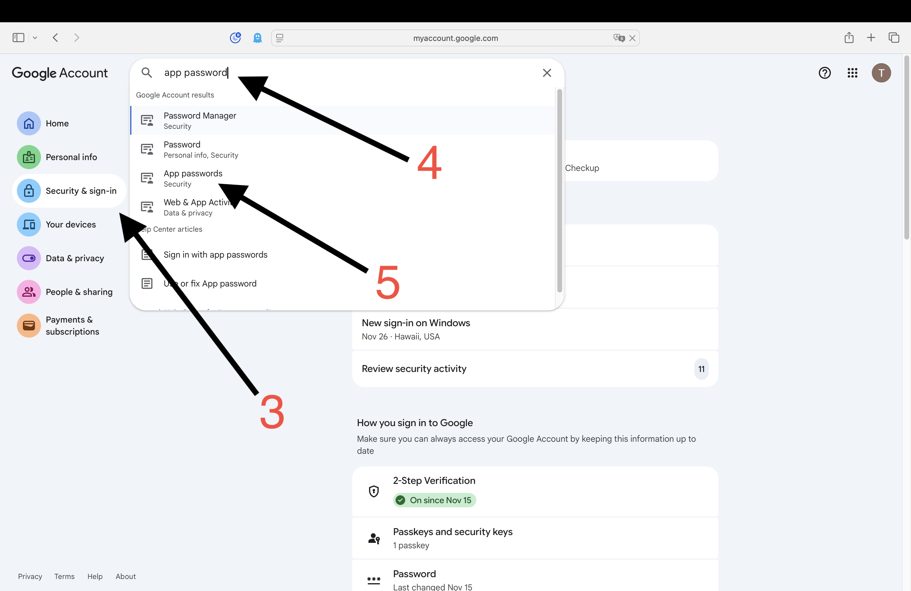
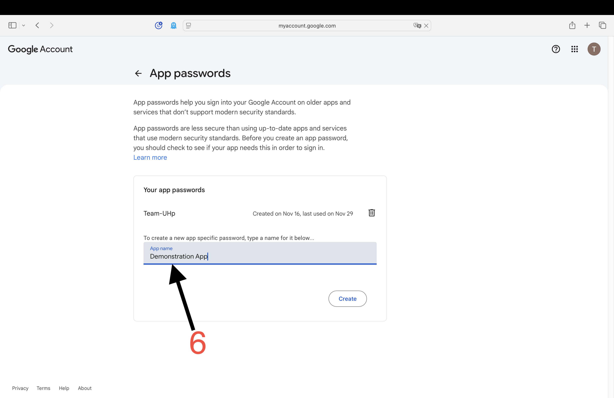
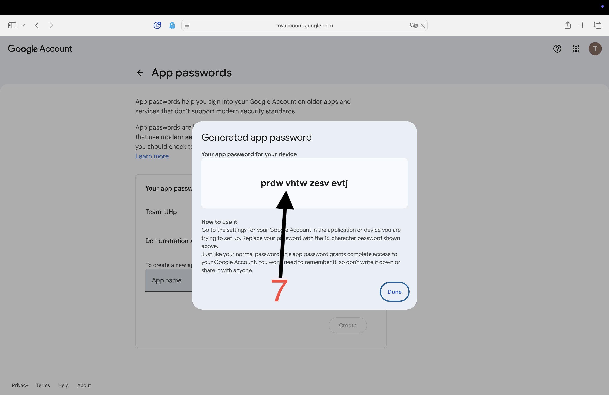
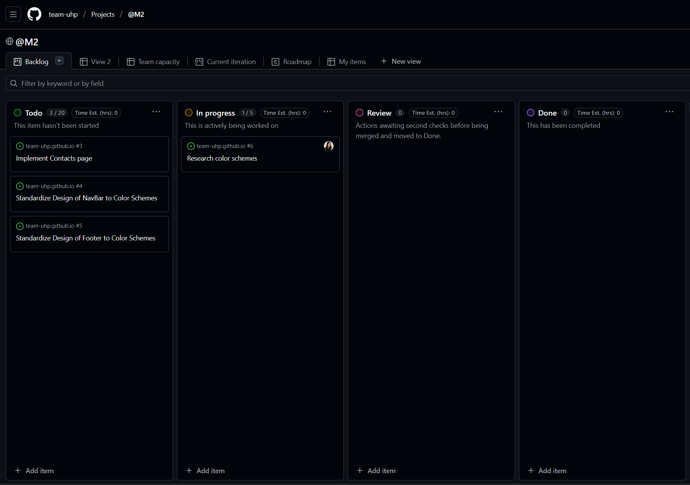
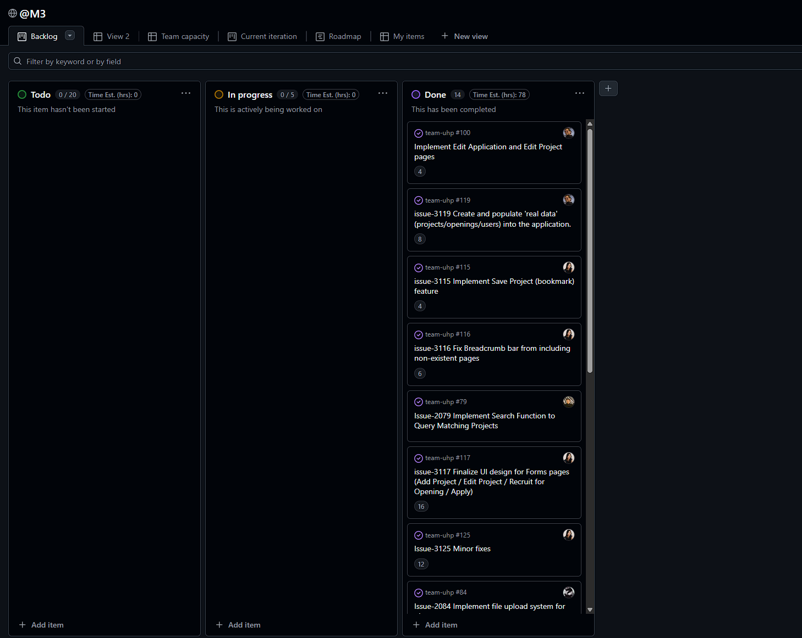

<link rel="stylesheet" href="./style.css">

# Team UHp!

## Table of contents
- [Overview](#overview)
- [Deployment](#deployment)
- [User Guide](#user-guide)
- [Developer Guide](#developer-guide)
- [Continuous Integration](#continuous-integration)
- [Development History](#development-history)
- [Community Feedback](#community-feedback)
- [Team](#team)
- [Contact Us](#contact-us)

## Overview

Many college students want to build real-world experience and strengthen their resumes through hands-on projects. However, the scope and complexity of meaningful and large-scale projects may exceed their current technical skills or confidence. Such a gap makes it difficult for students to initiate or complete projects that truly showcase their abilities.

TeamUHP! is a platform for students to connect across areas of study by enabling them to upload project postings and recruit collaborators. Whether it’s a class assignment or a passion project, students can find teammates with complementary skills and allow each contributor to play a meaningful role that aligns with their field of study. This medium of collaboration helps students to gain practical experience, build teamwork skills, and add completed projects to their resumes.

## Deployment

The TeamUHp! web application is deployed through Vercel cloud platform and hosted at [team-uhp.vercel.app](https://team-uhp.vercel.app/).

## User Guide
This section provides a walkthrough of the TeamUHp! user interface and its capabilities.

**Landing Page**  
The landing page is presented to users when they visit the website. Clicking any of the internal page links without being signed in redirects the user to the Sign In page. Clicking the Helpful Tools link will take the user to a collection of external site links Team UHp thinks you might find helpful. Clicking the About Us or Resources links in the footer will redirect the user to those pages without requiring signing in.

**Sign In Page**  
The sign in page allows users to sign in and provides links for creating a new account or requesting a link to reset forgotten password.

**Forgot Password Page**  
If a user has forgotten their password, they may reset it by inputting the email associated with their account, and receive an email from TeamUHp automation (team.uhp.automation@gmail.com) to reset the password.

**Forgot Password Page**  
Similarly, if a user has forgotten their username, they may receive it by inputting the email associated with their account, and receive an email from TeamUHp automation (team.uhp.automation@gmail.com).

**Sign Up Page**  
If a user has no yet created an account, they may sign up using UH email address. After filling in the necessary account information, an automated email is sent to verify the account. The user must check their email to follow the link to verification. All automation links are sent from the team's automation contact: team.uhp.automation@gmail.com.

**List Projects Page**  
The project list provides clickable summaries for all active projects. The list is sorted by number of skills that the user and each project have in common. Projects can be searched by title dictionary matches or by skill select filters. Skill select filters will show results for all projects containing any of the selected skills in the filter.

**Add Projects Page**
Clicking on the "Add Project" button from the Project List page, users can post a project by filling in Ttitle, description, and due date of the project. Line breaks in the description input are preserved when displaying the description on the project page. 

**Project Page**  
Each individual project page displays the project's details. The project page provides the project image/banner, title, description, project members, openings on the project, and the skills sought across all openings. Clicking on openings will take users to the opening page. When logged in as a project's admin, the subsequent button "Recruit for Opening" is visible. Users can bookmark this project and it will appear in their “Saved Projects” filter toggle at the projects list page.

**Add Opening Page**  
The add opening page is used for project posters to open positions for members they seek to recruit. They can specify the title for the position, add a description for project tasks, select specific skills needed for the position, and schedule the dates for which the project is open to contributors:

**Opening Page**  
End users looking for projects will view a project page, then click on a specific position opening. The specified posiiton is detailed on its own page and provides the title, description, and skills sought of the project opening. Users can click the link to apply for the position. If a user has already applied to the opening, the button “Apply for this opening” will instead by “View My Application." If logged in as the original poster of a project, you can see users who have applied for the position. As the project’s poster, clicking on the user will open their application in an application page.

**Edit Opening Page**  
A project admin can edit an opening by clicking "Edit Opening" on the specified opening page. Here, fields can be rewritten, reselected, or deleted. Additionally, extra skills can be added via the drop down by field, and combined in summary.

**Apply for Opening Page**  
After clicking apply for opening, a form with a text area will be displayed. Here the user can submit their application to the project's poster for that specific project position.

**Application Page**  
Application admins can review the application, choose to accept or delete the application, here in the application page. For users who submit the application, they edit or delete their application at this page. Project posters are not notified if or when an application is edited. 

**Edit Project Page**  
A project admin can edit a project by clicking "Edit Project" on the specified project page. Here, fields can be rewritten, reselected, or deleted. Project admins can also add or remove members or admins from the project.

**User Profile Page**  
In the user profile page, a user’s contributed project previews are displayed, as well as the user’s name, username, email address, and skills. When viewing other users, you may add them by clicking the button “Add Contact” and it will save the user to your own contacts page. If the user is already added to your contacts, the button will be filled and replaced with “Remove Contact.”

**Edit Profile**  
In the edit profile page, you may edit your information involving your name, profile picture, phone number, and skills via field of study selection.

**Contacts Page**  
Contacts that you saved when viewing profiles will be collected and displayed here in the contacts page. If you have not added any contacts, no profile cards will be displayed. Note that contacts are added one-side. Users you save will not be notified that they have been added to your contacts list. 

**Helpful Tools Page**  
The helpful tools page is a composite of tools we think you’ll find useful in your collaboration with other eager technical enthusiasts and student groups. 

## Developer Guide
Pre-Requisites

* install the latest [node.js](https://nodejs.org/en)
* install the latest [postgreSQL](https://www.postgresql.org/download/)

First, install a code editor such as VS Code.

Second, go to the Team-UHp github repository and clone the repository to your computer.

Third, upon opening your new program, cd into the Team-UHp directory, and install the libraries by typing into the terminal:

<code>$ npm install</code>

Fourth, make a copy of the sample.env and rename it to .env. Change the DATABASE_URL user:password to your postgres username and password.

Fifth, create/migrate your local prisma database using this command:

<code>npx prisma migrate dev</code>

This will create the DB if it doesn't already exist as well as create the tables for data.

Sixth, seed the database with default test data:

<code>npx prisma db seed<code>

The test data can be found in config/settings.development.json. Feel free to add or remove test data

The prisma client should have already been generated by the migrate but just in case, run:

<code>npx prisma generate<code>

to generate your prisma client.

Fifth, run the app with the command:

<code>npm run dev</code>

If successful, you should see the application appear at http://localhost.3000

**Database Editing**  

To launch the prisma database editor on your web browser, run the command:

<code>npx prisma studio</code>

or install [pgAdmin4](https://www.pgadmin.org/download/)

If you want to use a remote hosting service such as vercel for your database, in your schema.prisma, uncomment the directURL line
and update your .env file with the remote database links.

<code>
datasource db { 
&nbsp;&nbsp;provider = "postgresql" 
&nbsp;&nbsp;// for local development 
&nbsp;&nbsp;url       = env("DATABASE_URL") 
&nbsp;&nbsp;// for Vercel, uncomment 
&nbsp;&nbsp;// directUrl = env("POSTGRES_URL")  <--- uncomment this to run on your remote DB 
}
</code>

**Gmail Automation Setup**  

This guide is not intended for professional applications. This guide is accurate as of November 30, 2025. Gmail may not permit extensive commercial use of its services without paying for the right to do so. This method is not nearly as secure as using OAuth 2.0 and google's API. Caveat emptor.

0\. Create a Gmail account with the name you want your app to be sending messages under. It is strongly recommended that this be professional, related to your app or company name, and include "noreply" in some form if you are not going to check the inbox for messages. The account must also have 2-Step Verification enabled.

1\. Visit [accounts.google.com](accounts.google.com)

2\. Click Go To Google Account.

3\. Click Security & sign-in.

4\. Type "app password" in the search bar.

5\. Click App Passwords in the dropdown.

6\. Type the nickname you want the password to be referred to as. This is not used anywhere except this list, so ensure the name will remind you what app it is for.

7\. Save this password. You will not be able to access it again once you close the popup.

8a. If you are running the app locally: in your .env file, type the following information (replace with your account information):

    #EMAIL_HOST=smtp.gmail.com
    GMAIL_USER=team.uhp.automation@gmail.com
    GMAIL_APP_PASSWORD=prdwvhtwzesvevtj
    
Note that the app password you generated earlier has no spaces.

8b. If you are running the app on Vercel: Go to your app, Settings, Environment Variables, and add your GMAIL_USER and GMAIL_APP_PASSWORD variables to the list.

## Continuous Integration

TeamUHp implements continuous integration using GitHub Actions, such that all commits into the main branch trigger a build of the system and the running of ESLint checks and all Playwright tests. Results of all recent workflows are viewable at https://github.com/team-uhp/team-uhp/actions. 

The workflow definition file is located at .github/workflows/ci.yml.
## Development History
The development process for TeamUHp conforms to Issue Driven Project Management (IDPM) practices. In this model: 
- Development consists of a sequence of Milestones.
- Each Milestone is specified as a set of tasks.
- Each task is described using a GitHub Issue, and is assigned to a single developer to complete.
- Tasks should typically consist of work that can be completed in 2-4 days.
- The work for each task is accomplished with a git branch named “issue-XX”, where XX is replaced by the issue number.
- When a task is complete, its corresponding issue is closed and its corresponding git branch is merged into master.
- The state (todo, in progress, complete) of each task for a milestone is managed using a GitHub Project Board.
- The following sections document the development history of BowFolios.

**Milestone 1: Mockup development**  
The goal of Milestone 1 was to create a set of HTML pages providing a mockup of the pages in the system.

Milestone 1 was managed using [TeamUHp GitHub Project Board M1:](https://github.com/orgs/team-uhp/projects/1)

**Milestone 2: Improved Functionality & UI design**  
The goal of Milestone 2 is to improve functionality and quality of the application, including functionality of mockups created in M1, adding mockups to that supplement to existing pages, and finalize the overall design of the landing, projects, openings, and form pages.

Milestone 2 was managed using [TeamUHp GitHub Project Board M2:](https://github.com/orgs/team-uhp/projects/3)

**Milestone 3: Complete Functionality & Supplementary Features**  
The goal of Milestone 3 is to complete final functionality of critical features, and complete implementation of supplementary features that were added in design, in preperation for user-feedback of the live production.

Milestone 3 is managed using [TeamUHp GitHub Project Board M3:](https://github.com/orgs/team-uhp/projects/6)

## Community Feedback

Community Review Currently in Progress

We asked five community members to review the application and provide their feedback. Their insights are summarized below.

**UI and Ease of Use**  
Overall, the community members agreed that the application is streamlined and user-friendly, both on PC and mobile platforms. All tested functionality worked without errors. Users commented that the application shows clear benefits for students seeking to apply their skills collaboratively. The interface was generally praised for being intuitive and easy to navigate.

**Opportunities for Imporvement**  
Several suggestions were made to further improve usability and presentation:
- Allow project admins to crop or square images, ensuring they appear uniform when previewed as banners on the project list page.
- Limit the display of skills to the top 10 in the project list to reduce visual clutter.
- Order projects by upcoming due dates or relevance to the user’s skills, making it easier for users to find opportunities that match their interests.
- Introduce trackers for ongoing projects and submitted applications to help users monitor their progress.

**App Performance**  
Some users reported minor delays when loading pages with large amounts of data, such as refreshing the project page. Additionally, automated notifications sometimes took a few minutes to arrive, which could affect timely communication.

**Bugs and Anomalies**  
One user experienced duplicate entries when interacting with clickable features rapidly, and suggested adding a short cooldown for interactive elements (buttons, links, submissions) to prevent accidental duplication, especially given asynchronous cloud deployment and database fetching. 

## Team
[Team Contract](https://docs.google.com/document/d/1vcm45B1ehz_Joi1jSSsUXPrAqlw8uORYBjaiFehP7uw/edit?usp=sharing) 
TeamUHp! is designed, implemented, and maintained by Jayden Francoise, Matthew Matsumoto, Raymond Acker, Joan Zara, and Jun Xiang (Juno) Zeng.

  

    
    <h3>Jayden Francoise</h3>
    <a href="https://jaydenfrn.github.io/">jaydenfrn.github.io</a>
    
Computer Science Student at University of Hawaii at Manoa

  

  

    
    <h3>Matthew Matsumoto</h3>
    <a href="https://matthewmatsumoto.github.io/">matthewmatsumoto.github.io</a>
    
Computer Science Student at University of Hawaii at Manoa

  

  
  

    
    <h3>Raymond Acker</h3>
    <a href="https://ackerrs.github.io/">ackerrs.github.io</a>
    
Computer Science major at UH Manoa, rock climber, and avid reader

  

  

    
    <h3>Joan Zara</h3>
    <a href="https://jn1za.github.io/">jn1za.github.io</a>
    
Computer Science Student, Cybersecurity enthusiast, and music lover.

  

  

    
    <h3>Jun Xiang (Juno) Zeng</h3>
    <a href="https://junoxzeng.github.io/">junoxzeng.github.io</a>
    
Computer Science Student at University of Hawaii at Manoa

  

## Contact Us
The team email is team.uhp.automation@gmail.com. Alternate forms of contacting members are available on our individual github.io profiles above.
