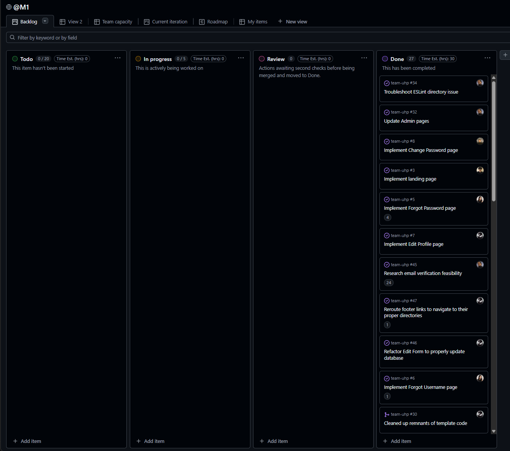

<link rel="stylesheet" href="./style.css">

# Team UHp!

## Table of contents
- [Overview](#overview)
- [User Guide](#user-guide)
- [Development History](#development-history)
- [Team](#team)

## Overview
TeamUHP! is a platform for students to connect across areas of study by enabling them to upload project postings and recruit collaborators. Whether it’s a class assignment or a passion project, students can find teammates with complementary skills and allow each contributor to play a meaningful role that aligns with their field of study. This medium of collaboration helps students to gain practical experience, build teamwork skills, and add completed projects to their resumes.

## User Guide
This section provides a walkthrough of the TeamUHp! user interface and its capabilities.

**Landing Page**  
The landing page is presented to users when they visit the top-level URL to the site.

**Add Opening Page**  

**List Projects Page**  

## Development History
The development process for TeamUHp conforms to Issue Driven Project Management (IDPM) practices. In this model: 
- Development consists of a sequence of Milestones.
- Each Milestone is specified as a set of tasks.
- Each task is described using a GitHub Issue, and is assigned to a single developer to complete.
- Tasks should typically consist of work that can be completed in 2-4 days.
- The work for each task is accomplished with a git branch named “issue-XX”, where XX is replaced by the issue number.
- When a task is complete, its corresponding issue is closed and its corresponding git branch is merged into master.
- The state (todo, in progress, complete) of each task for a milestone is managed using a GitHub Project Board.
- The following sections document the development history of BowFolios.

**Milestone 1: Mockup development**  
The goal of Milestone 1 was to create a set of HTML pages providing a mockup of the pages in the system.

Milestone 1 was managed using [TeamUHp GitHub Project Board M1:](https://github.com/orgs/team-uhp/projects/1)

Current milestone in progress.

## Team
TeamUHp! is designed, implemented, and maintained by Jayden Francoise, Matthew Matsumoto, Raymond Acker, Joan Zara, and Jun Xiang (Juno) Zeng.

  

    
    <h3>Jayden Francoise</h3>
    <a href="https://jaydenfrn.github.io/">jaydenfrn.github.io</a>
    
Computer Science Student at University of Hawaii at Manoa

  

  

    
    <h3>Matthew Matsumoto</h3>
    <a href="https://matthewmatsumoto.github.io/">matthewmatsumoto.github.io</a>
    
Computer Science Student at University of Hawaii at Manoa

  

  
  

    
    <h3>Raymond Acker</h3>
    <a href="https://ackerrs.github.io/">ackerrs.github.io</a>
    
Computer Science Student at University of Hawaii at Manoa

  

  

    
    <h3>Joan Zara</h3>
    <a href="https://jn1za.github.io/">jn1za.github.io</a>
    
Computer Science Student at University of Hawaii at Manoa

  

  

    
    <h3>Jun Xiang (Juno) Zeng</h3>
    <a href="https://junoxzeng.github.io/">junoxzeng.github.io</a>
    
Computer Science Student at University of Hawaii at Manoa

  

